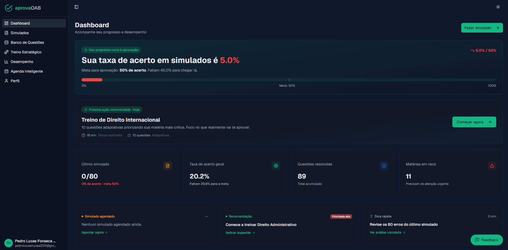
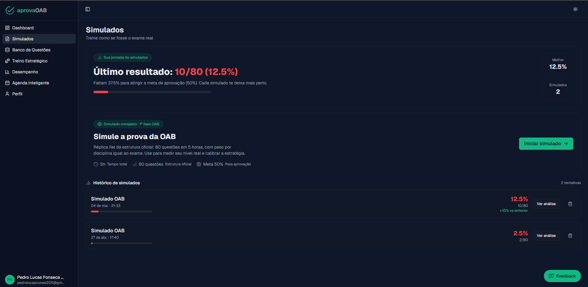
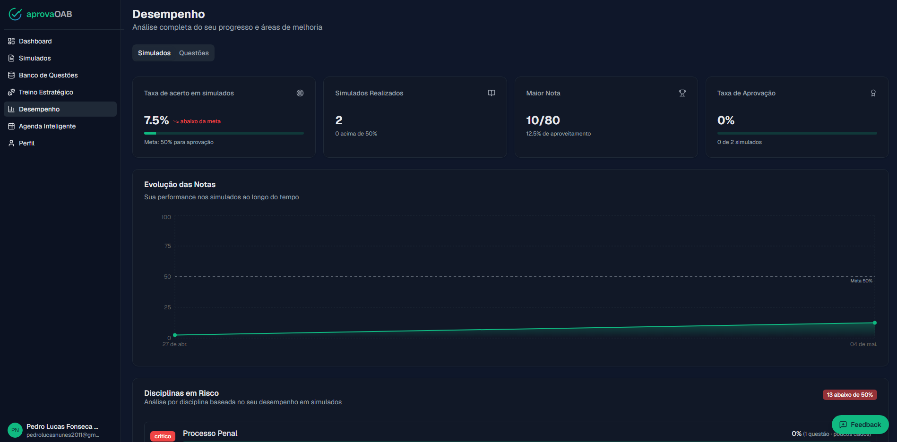
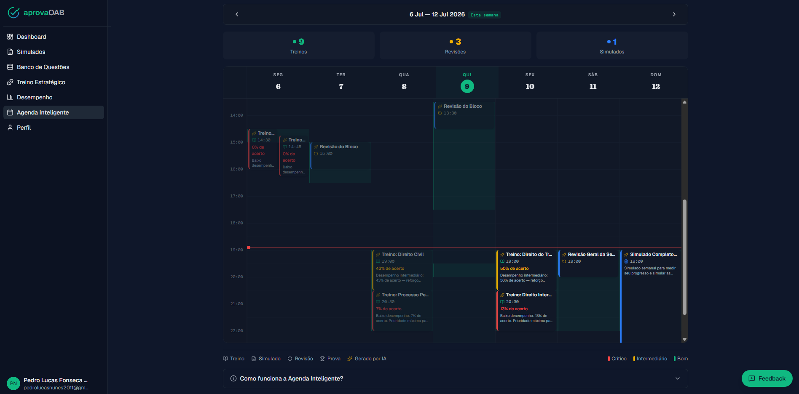

# AprovaOAB

**SaaS de preparação para a 1ª fase do Exame da OAB** — estude só o que você precisa pra passar.

🔗 **No ar em produção: [aprovaoab.app.br](https://www.aprovaoab.app.br)**


---

## Sobre

O AprovaOAB parte de um diagnóstico do candidato e monta a preparação em cima dos
**erros dele**: o treino redistribui as questões para as matérias onde ele mais perde
pontos, a agenda de estudos se encaixa na disponibilidade real da semana e o
desempenho fica visível por matéria — menos volume cego, mais direção.

É um produto **em produção, com assinantes reais**: modelo freemium (plano Grátis com
10 questões/dia; plano Pro com questões ilimitadas e simulados completos), pagamentos
recorrentes via Stripe e deploy contínuo na Vercel.

Projeto solo: produto, código, conteúdo e operação.

## Screenshots

**Dashboard** — visão geral do progresso, próxima ação recomendada e matérias em risco



**Simulados** — réplica fiel da prova: 80 questões em 5 horas, histórico e análise



**Desempenho** — evolução das notas e disciplinas em risco por banda



**Agenda inteligente** — semana de estudos gerada automaticamente pelo desempenho



## Funcionalidades

- **Banco com 2.100+ questões reais da FGV** (27 edições do Exame de Ordem), com
  explicação comentada em cada questão
- **Simulados completos de 80 questões** no formato exato do dia da prova
- **Treino inteligente**: ~70% das questões vêm das matérias mais fracas do aluno,
  ~30% de manutenção geral — e questões já acertadas não se repetem
- **Diagnóstico inicial** que mapeia os pontos fracos logo no cadastro
- **Dashboard de desempenho** com aproveitamento por matéria e evolução semanal
- **Agenda de estudos automática** que respeita a disponibilidade do aluno e
  sincroniza com o Google Calendar
- **Newsletter semanal** (Café com OAB) com termômetro de erros da base e questão comentada
- **Painel admin** para gestão de questões (CRUD, importação/exportação CSV), usuários e feedback

## Stack

| Camada | Tecnologia |
|---|---|
| Framework | Next.js 16 (App Router) + React 19 + TypeScript |
| Banco e Auth | Supabase (Postgres com Row Level Security + Auth) |
| Pagamentos | Stripe (assinaturas + webhooks) |
| UI | Tailwind CSS v4 + shadcn/ui (Radix) + Recharts |
| E-mail | Resend (transacional e broadcasts) |
| Infra | Vercel (deploy contínuo), Upstash (rate limiting), Sentry (monitoramento) |

## Destaques de engenharia

**Segurança em camadas.** Todo acesso a dados passa por RLS no Postgres; a service
role key do Supabase só existe em código server-side, atrás dos guards
`requireUser()`/`requireAdmin()` que protegem todas as rotas de API. Páginas públicas
projetam explicitamente apenas os campos que podem ir ao HTML.

**Stripe como fonte única da assinatura.** O plano do usuário é atualizado
exclusivamente pelo webhook do Stripe, com validação de assinatura do evento — o
cliente nunca escreve o próprio plano. O limite diário do plano grátis tem defesa em
dupla camada: verificação na API e trigger atômico no banco.

**Treino que aprende com o erro.** O algoritmo agrega o desempenho por matéria
(priorizando dados de simulado, que são a medição limpa), seleciona as 3 matérias de
maior risco e monta a sessão 70/30 com fallbacks para quem ainda tem pouco histórico.

**Timezone tratado de verdade.** Timestamps UTC naive do Postgres passam por um módulo
central de datas (`lib/datas.ts`) que parseia, formata e agrupa tudo no fuso de
Brasília — evitando a clássica diferença de 3h entre servidor e navegador.

**Integração Google Calendar com criptografia.** Tokens OAuth são criptografados com
AES-256-GCM antes de tocar o banco, com refresh automático; a sincronização é
best-effort e nunca bloqueia o fluxo do aluno.

**SEO programático.** Mais de 200 páginas públicas de questões geradas estaticamente
(SSG) no build, com Open Graph dinâmico por página.

## Estrutura do projeto

```
app/
  api/          rotas de API (auth, Stripe, treino, agenda, admin…)
  dashboard/    área logada: questões, simulados, treino, agenda, desempenho
  admin/        painel administrativo
  questoes/     páginas públicas de questões (SSG)
components/     UI (shadcn/ui) + seções da landing
lib/            clientes Supabase/Stripe, datas/timezone, métricas, serviços
```

## Rodando localmente

O projeto depende de serviços externos próprios (Supabase, Stripe, Google OAuth,
Resend). Com os projetos provisionados:

```bash
npm install
# criar .env.local com as variáveis abaixo
npm run dev   # localhost:3000
```

Variáveis de ambiente: `NEXT_PUBLIC_SUPABASE_URL`, `NEXT_PUBLIC_SUPABASE_ANON_KEY`,
`SUPABASE_SERVICE_ROLE_KEY`, `STRIPE_SECRET_KEY`, `STRIPE_WEBHOOK_SECRET`,
`NEXT_PUBLIC_STRIPE_PUBLISHABLE_KEY`, `STRIPE_PRICE_PRO`, `GOOGLE_CLIENT_ID`,
`GOOGLE_CLIENT_SECRET`, `TOKEN_ENCRYPTION_KEY`, `NEXT_PUBLIC_APP_URL`.

## Licença e status

Este repositório é público como **portfólio**. O AprovaOAB é um produto comercial em
produção — o código não está licenciado para uso, cópia ou redistribuição.
**Todos os direitos reservados.**

## Autor

**Pedro Lucas** — [GitHub](https://github.com/Pedrolucasnunes) · [aprovaoab.app.br](https://www.aprovaoab.app.br)
